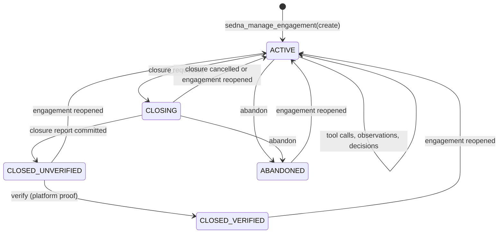

# Unified Engagement Lifecycle

This document maps Sedna's engagement journal states to the rolling `pt-report.py` workflow, ensuring dual-track auditability.

## State Machine



## Sedna Engagement States

| State | Description | pt-report Equivalent |
|-------|-------------|---------------------|
| `active` | Created engagement; evidence and planning may proceed | `pt-report.py init`, then reviewed updates |
| `closing` | Closure barrier requested while terminal work and report settle | Final reviewed imports and render |
| `closed_unverified` | All required proofs met, awaiting verification | Report complete but unverified |
| `closed_verified` | Platform verification submitted | Verified badge in report |
| `abandoned` | Engagement explicitly abandoned; it may later be reopened to `active` | Report retained without verification |

Promotion is a journaled saga associated with a verified engagement, not a
separate `EngagementStatus`. Reopening is an event transition back to `active`,
not a persistent `reopened` status.

## Data Flow Mapping

### Sedna → pt-report (via `sync-engagement-report.py`)

| Sedna Event | pt-report Action |
|-------------|------------------|
| `decision_recorded` | `add-note` containing only the private event UUID |
| `observation_extracted` | `add-observation` containing only the private event UUID |
| Every other event | Not exported automatically |

### pt-report → Sedna (Manual / Operator)

| pt-report Action | Sedna Equivalent |
|------------------|------------------|
| `add-observation` with findings | Auto-captured via hooks during tool execution |
| `import-nmap` | Evidence blob stored, parsed for observations |
| `render` | Generates HTML for Tailnet sharing |

## Evidence & Privacy Boundaries

### Private (Sedna Journal Only - Never Exported)
- Raw platform proof values
- Root/user credential hashes
- Provider API tokens
- Private host network paths
- Full command outputs with sensitive data

### Sanitized (Eligible for explicit promotion; not copied by the sync helper)
- Service versions, port states
- Technique descriptions (without payload specifics)
- Strategic observations
- CVEs, CWE references
- Redacted proof of concept (last 6 chars only)

### Public (pt-report HTML on Tailnet)
- Executive summary
- Findings table (service, port, severity, remediation)
- Methodology & tools used
- Limitations & scope
- Timeline of commands (sanitized)

## Synchronization Protocol

### During Active Engagement
```bash
# Run periodically (e.g., after each major scan)
./scripts/sync-engagement-report.py \
  --sedna-root ~/.hermes/knowledge/sedna \
  --engagement-id <sedna-engagement-uuid> \
  --pt-engagement htb-target \
  --pt-report-script /trusted/path/pt-report.py
```

The `--pt-report-script` path is mandatory. The helper opens it no-follow,
verifies a current-user-owned regular file with one link and no group/world
write bits, then invokes the verified descriptor through `/proc/self/fd`.

The helper is idempotent across completed invocations and fail-closed across
ambiguous crash windows. Before each destination mutation it atomically persists
the event UUID as `pending_event_id`; only a successful checked subprocess moves
that UUID to `completed_event_ids`. If the process stops in between, the next run
raises `manual reconciliation required` before any subprocess instead of risking
a duplicate. The checkpoint schema accepts only bounded version-2 documents
(maximum 1 MiB and 8192 completed UUIDs) with closed keys, canonical UUIDs,
and no free text. Legacy versions fail closed instead of migrating implicitly.

As defense in depth, each Sedna event UUID is also passed to `pt-report.py` as
`--idempotency-key`; compatible destinations atomically enforce uniqueness for
that key on `add-note` and `add-observation`. A destination without this option
fails closed and leaves the pending barrier in place. The local write-ahead
barrier, not an unverifiable destination assumption, prevents automatic replay.

The helper serializes concurrent syncs per engagement/report and atomically
stores only sorted completed event UUIDs plus at most one pending UUID under
`<sedna-root>/.pt-report-sync/<engagement-uuid>/`. All journal,
state-directory, and checkpoint components are opened through verified owned
directory descriptors with no-follow semantics; the verified engagement state
descriptor itself is locked, so no lock file is created. The selected root,
engagement, journal, state directories, and checkpoint files must be owned by
the current user and not group/world writable. Symlinks, hard-linked state
files, and unsafe modes fail closed. The report name is represented only by a SHA-256
filename; payloads are never checkpointed. A malformed checkpoint fails closed
instead of replaying all events.

### At Verification
```bash
# 1. Final sync
./scripts/sync-engagement-report.py --engagement-id <uuid> --pt-engagement htb-target \
  --pt-report-script /trusted/path/pt-report.py

# 2. Verify Sedna promotion
sedna_manage_engagement action=inspect

# 3. Verify Tailnet endpoint
curl -I https://titagram.tail005130.ts.net:8899/engagements/htb-target/
```

## Recovery Procedures

| Scenario | Recovery Action |
|----------|-----------------|
| Host crash mid-write | `sedna_manage_engagement action=resolve_call` for orphaned calls |
| Interrupted promotion | `sedna_manage_engagement action=resume` or `action=inspect` |
| pt-report corruption | Reinitialize the report, re-sync UUID pointers, then repeat any separately reviewed imports |
| Index drift | `sedna_knowledge_maintenance operation=rebuild` then re-sync |

## Verification Checklist

- [ ] Every major tool execution appears in Sedna; only separately reviewed imports appear in pt-report
- [ ] Every observation explicitly promoted to pt-report has corresponding Sedna evidence
- [ ] No raw flags/credentials in pt-report HTML or Sedna promoted bundles
- [ ] Tailnet URL returns 200 after final render
- [ ] `sedna_manage_engagement action=inspect` shows promotion complete